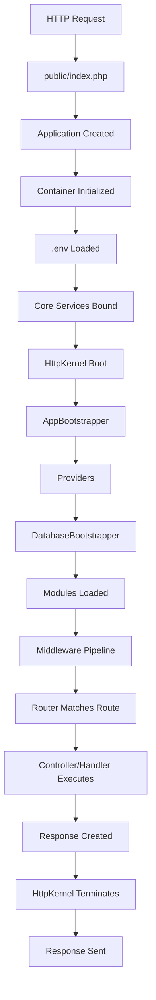
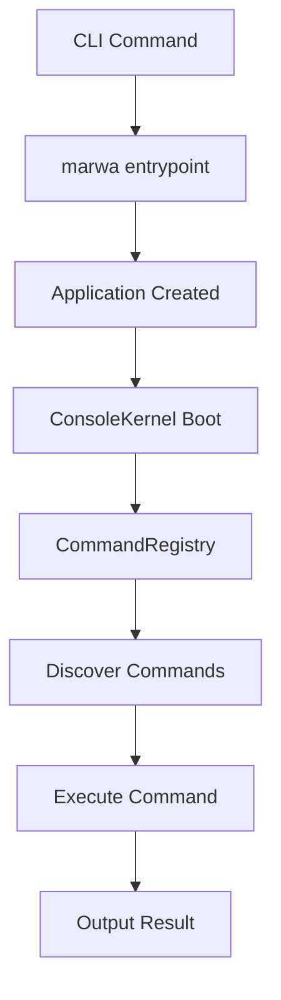
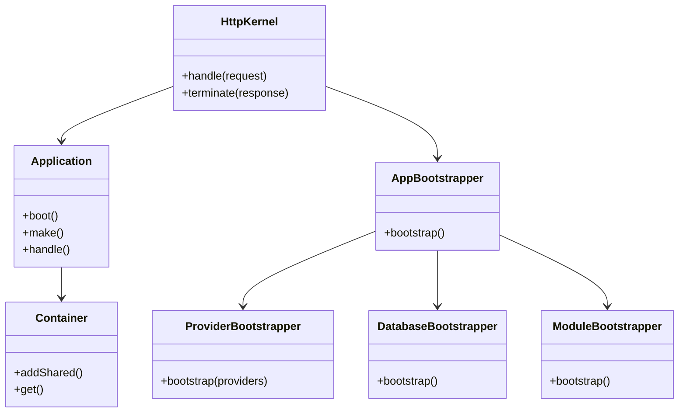
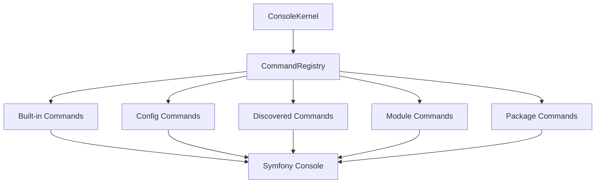

# Boot Flow

This guide describes the detailed bootstrap flow of the Marwa Framework.

## HTTP Request Flow



## Console Flow



## Detailed HTTP Boot Sequence

### Phase 1: Application Creation

```php
// public/index.php
$app = new Application(__DIR__ . '/..');
```

1. **Application Constructor** - Sets base path, initializes container
2. **Environment Load** - Loads `.env` file
3. **Core Binding** - Registers Application, Container interfaces

### Phase 2: Bootstrap

```php
// Inside HttpKernel
$app->bootstrap();
```

1. **ErrorHandlerBootstrapper** - Registers a minimal handler before config loading
2. **AppBootstrapper** - Loads configuration
3. **ProviderBootstrapper** - Boots service providers
4. **ErrorHandlerBootstrapper** - Applies config-driven logger, debugbar, and renderer settings
5. **DatabaseBootstrapper** - Initializes database connection
6. **ModuleBootstrapper** - Loads modules

### Phase 3: Request Handling

```php
// Handle request
$response = $kernel->handle($request);
```

1. **Middleware Pipeline** - Processes global middleware
2. **Router** - Matches incoming route
3. **Controller** - Executes handler
4. **Response** - Returns HTTP response

## Core Components



## Service Registration Order

| Phase | Services | Description |
|-------|----------|------------|
| 1 | Config, Storage | Basic services |
| 2 | Logger, Events | Logging and events |
| 3 | Cache, HTTP, Mail | Request services |
| 4 | Notifications | Notification channels |
| 5 | Session, Security | Web services |
| 6 | Error Handler | Early handler registration and config-aware tuning |
| 7 | Database | Database connection |
| 8 | Providers | Custom providers |
| 9 | Modules | Module loading |

## Middleware Pipeline

```mermaid
flowchart LR
    A[Request] --> B[RequestIdMiddleware]
    B --> C[SessionMiddleware]
    C --> D[MaintenanceMiddleware]
    D --> E[SecurityMiddleware]
    E --> F[RouterMiddleware]
    F --> G[Route Handler]
    G --> H[Response]
    
    B -.->|add X-Request-ID| A
    C -.->|init session| B
    D -.->|check mode| C
    E -.->|apply security| D
    F -.->|dispatch route| E
```



## Console Command Discovery



## Service Lazy Loading

The framework uses lazy loading for optimal performance:

```php
// Eager loading (before)
$container->addShared(Service::class, new Service());

// Lazy loading (current convention)
$container->addShared(Service::class, fn () => new Service());
```

Services that are lazy-loaded:
- CommandRegistry
- ConsoleKernel
- Scheduler
- RiskAnalyzer
- DBForge
- SeedRunner

## Next Steps

- [Architecture Overview](../architecture.md) - Design decisions
- [Configuration](../reference/config.md) - Config options
- [Middleware](../reference/middleware.md) - Custom middleware
