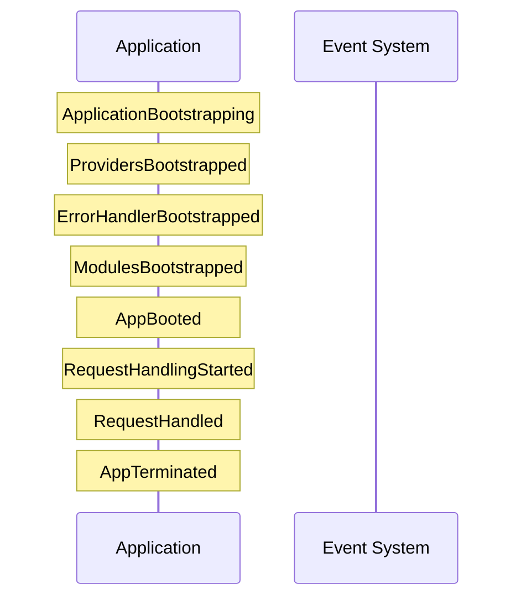

# Events Reference

This document lists all framework events and how to use them.

## Event List

| Event | Description | Location |
|-------|-------------|----------|
| ApplicationBootstrapping | App bootstrap started | `src/Adapters/Event/ApplicationBootstrapping.php` |
| AppBooted | Application booted | `src/Adapters/Event/AppBooted.php` |
| ProvidersBootstrapped | Service providers booted | `src/Adapters/Event/ProvidersBootstrapped.php` |
| ErrorHandlerBootstrapper | Error handler ready | `src/Adapters/Event/ErrorHandlerBootstrapped.php` |
| ModulesBootstrapped | Modules loaded | `src/Adapters/Event/ModulesBootstrapped.php` |
| ApplicationStarted | HTTP request started | `src/Adapters/Event/ApplicationStarted.php` |
| ConsoleBootstrapped | Console ready | `src/Adapters/Event/ConsoleBootstrapped.php` |
| RequestHandlingStarted | Request processing | `src/Adapters/Event/RequestHandlingStarted.php` |
| RequestHandled | Request completed | `src/Adapters/Event/RequestHandled.php` |
| AppTerminated | Application shutdown | `src/Adapters/Event/AppTerminated.php` |

## Event Timeline



## Event Details

### ApplicationBootstrapping

Fired when application bootstrap begins.

```php
use Marwa\Framework\Adapters\Event\ApplicationBootstrapping;

$app->listen(ApplicationBootstrapping::class, function (ApplicationBootstrapping $event) {
    // Bootstrap started
    $basePath = $event->basePath;
    $time = $event->time;
});
```

**Properties:**
- `basePath`: Application base path
- `time`: Timestamp

### AppBooted

Fired after application is fully booted.

```php
use Marwa\Framework\Adapters\Event\AppBooted;

$app->listen(AppBooted::class, function (AppBooted $event) {
    // App is ready
});
```

### ProvidersBootstrapped

Fired after all service providers are booted.

```php
use Marwa\Framework\Adapters\Event\ProvidersBootstrapped;

$app->listen(ProvidersBootstrapped::class, function (ProvidersBootstrapped $event) {
    // $event->providers contains booted providers
});
```

**Properties:**
- `providers`: List of provider class names

### ErrorHandlerBootstrapped

Fired after error handler is configured.

```php
use Marwa\Framework\Adapters\Event\ErrorHandlerBootstrapped;

$app->listen(ErrorHandlerBootstrapped::class, function (ErrorHandlerBootstrapped $event) {
    // Error handling is ready
});
```

### ModulesBootstrapped

Fired after all modules are loaded.

```php
use Marwa\Framework\Adapters\Event\ModulesBootstrapped;

$app->listen(ModulesBootstrapped::class, function (ModulesBootstrapped $event) {
    // Modules loaded
});
```

### ApplicationStarted

Fired when framework handles a request.

```php
use Marwa\Framework\Adapters\Event\ApplicationStarted;

$app->listen(ApplicationStarted::class, function (ApplicationStarted $event) {
    // Request started
});
```

### ConsoleBootstrapped

Fired when console is ready.

```php
use Marwa\Framework\Adapters\Event\ConsoleBootstrapped;

$app->listen(ConsoleBootstrapped::class, function (ConsoleBootstrapped $event) {
    // Console ready
});
```

### RequestHandlingStarted

Fired when request handling begins.

```php
use Marwa\Framework\Adapters\Event\RequestHandlingStarted;

$app->listen(RequestHandlingStarted::class, function (RequestHandlingStarted $event) {
    $method = $event->method;
    $path = $event->path;
});
```

**Properties:**
- `method`: HTTP method
- `path`: Request path

### RequestHandled

Fired after request is handled.

```php
use Marwa\Framework\Adapters\Event\RequestHandled;

$app->listen(RequestHandled::class, function (RequestHandled $event) {
    $method = $event->method;
    $path = $event->path;
    $statusCode = $event->statusCode;
});
```

**Properties:**
- `method`: HTTP method
- `path`: Request path
- `statusCode`: HTTP status code

### AppTerminated

Fired when application terminates.

```php
use Marwa\Framework\Adapters\Event\AppTerminated;

$app->listen(AppTerminated::class, function (AppTerminated $event) {
    $statusCode = $event->statusCode;
    // Cleanup tasks
});
```

**Properties:**
- `statusCode`: Response status code

## Listening to Events

### Using Event Listener

```php
// In a service provider
use Marwa\Framework\Contracts\EventDispatcherInterface;

public function boot(): void
{
    $this->container->get(EventDispatcherInterface::class)
        ->listen(RequestHandled::class, function (RequestHandled $event) {
            // Log request
            logger()->info('Request handled', [
                'method' => $event->method,
                'path' => $event->path,
                'status' => $event->statusCode,
            ]);
        });
}
```

### Using Event Facade

```php
use Marwa\Framework\Facades\Event;

Event::listen(RequestHandled::class, function (RequestHandled $event) {
    // Handle event
});

Event::subscribe(UserRegistered::class, [
    SendWelcomeEmail::class,
    LogRegistration::class,
]);
```

### Using Listener Class

```php
// app/Listeners/RequestLogger.php
<?php

declare(strict_types=1);

namespace App\Listeners;

use Marwa\Framework\Adapters\Event\RequestHandled;
use Psr\Log\LoggerInterface;

final class RequestLogger
{
    public function __construct(
        private LoggerInterface $logger
    ) {}

    public function handle(RequestHandled $event): void
    {
        $this->logger->info('Request completed', [
            'method' => $event->method,
            'path' => $event->path,
            'status' => $event->statusCode,
        ]);
    }
}
```

## Dispatching Events

### From Your Code

```php
use Marwa\Framework\Adapters\Event\NamedEvent;

$event = new NamedEvent('user.registered', [
    'user' => $user,
    'email' => $user->email,
]);

$app->dispatch($event);
```

### Custom Events

```php
// app/Events/UserRegistered.php
<?php

declare(strict_types=1);

namespace App\Events;

use Marwa\Framework\Adapters\Event\AbstractEvent;

final class UserRegistered extends AbstractEvent
{
    public function __construct(
        public readonly \App\Models\User $user
    ) {}
}

// Dispatch
$app->dispatch(new UserRegistered($user));
```

## Event Priorities

```php
// Higher priority runs first
Event::listen(Event::class, $listener, 10);
```

## Stopping Propagation

```php
$event->stopPropagation(true);
```

## Related

- [Events Tutorial](../tutorials/events.md) - Event handling guide
- [API Reference](index.md) - More reference docs