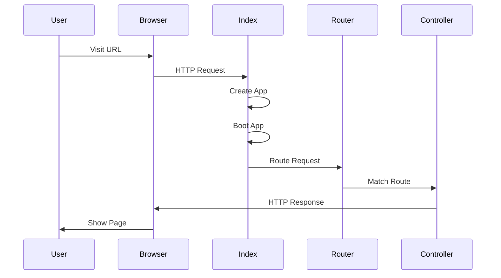
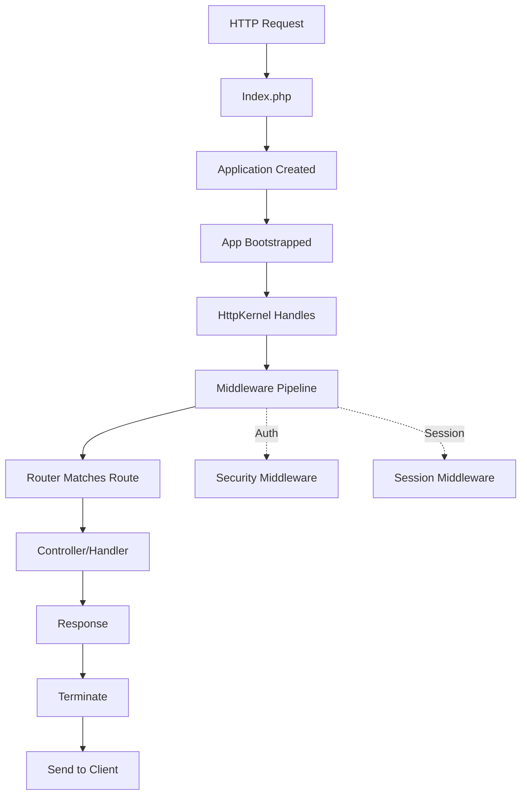

# Quick Start

Build your first Marwa Framework application in under 5 minutes.

> **Prerequisites**: Complete [Installation](getting-started/installation.md) first

If you prefer to start from a ready-made app skeleton, use [`memran/marwa-php`](https://github.com/memran/marwa-php). This tutorial is for developers who want to wire the framework package into an application manually.

## What We'll Build

A simple web application with:
- A health check endpoint
- A welcome page
- Error handling

## Step 1: Create Your Application

Open `public/index.php` and add:

```php
<?php

use Marwa\Framework\Application;
use Marwa\Framework\HttpKernel;
use Marwa\Framework\Adapters\HttpRequestFactory;

require __DIR__ . '/../vendor/autoload.php';

$app = new Application(__DIR__ . '/..');
$app->boot();

$kernel = $app->make(HttpKernel::class);
$request = $app->make(HttpRequestFactory::class)->request();

$response = $kernel->handle($request);
$kernel->terminate($response);
```

## Step 2: Add Routes

Open `routes/web.php` and add:

```php
use Marwa\Framework\Facades\Router;
use Marwa\Router\Response;

// Health check endpoint
Router::get('/health', fn () => Response::json([
    'status' => 'ok',
    'timestamp' => time()
]))->register();

// Welcome page
Router::get('/', fn () => Response::html('
    <!DOCTYPE html>
    <html>
    <head>
        <title>Welcome</title>
    </head>
    <body>
        <h1>Welcome to Marwa Framework</h1>
        <p>Your first application is running!</p>
    </body>
    </html>
'))->register();
```

## Step 3: Run the Server

```bash
php -S localhost:8000 -t public
```

Visit `http://localhost:8000/health`:

```json
{"status":"ok","timestamp":1712684400}
```

Visit `http://localhost:8000/`:

```html
<!DOCTYPE html>
<html>
<head>
    <title>Welcome</title>
</head>
<body>
    <h1>Welcome to Marwa Framework</h1>
    <p>Your first application is running!</p>
</body>
</html>
```

## How It Works



## Request Flow



## Step 4: Verify with Tests

Run the test suite:

```bash
composer test
```

You should see:

```
OK (99 tests, 569 assertions)
```

Run static analysis:

```bash
composer stan
```

You should see:

```
[OK] No errors
```

## What's Next?

You now have a working application. Explore these guides:

| Topic | Description |
|-------|-------------|
| [Controllers](controllers.md) | Handle HTTP requests |
| [Validation](validation.md) | Validate user input |
| [View](view.md) | Use Twig templates |
| [Models](models.md) | Work with databases |
| [Database](database.md) | DB management commands |
| [Console](console.md) | CLI commands |

## Common Issues

### "Class not found"

Run:

```bash
composer dump-autoload
```

### Database Error

If using SQLite, create the database:

```bash
touch database/app.sqlite
```

### Port in Use

Use a different port:

```bash
php -S localhost:8080 -t public
```

## Reference

- [Architecture](../architecture.md) - How the framework works
- [Configuration](../reference/config.md) - All config options
- [Getting Started](../getting-started/index.md) - More installation details
